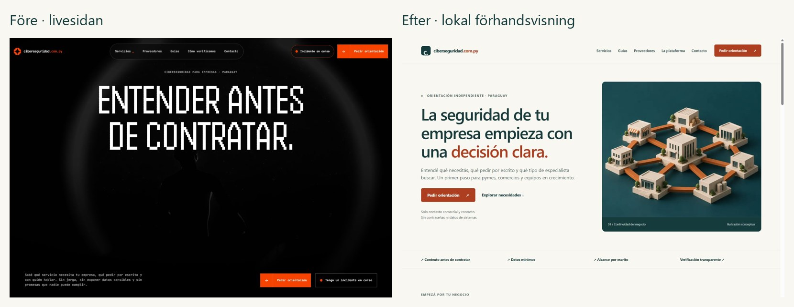
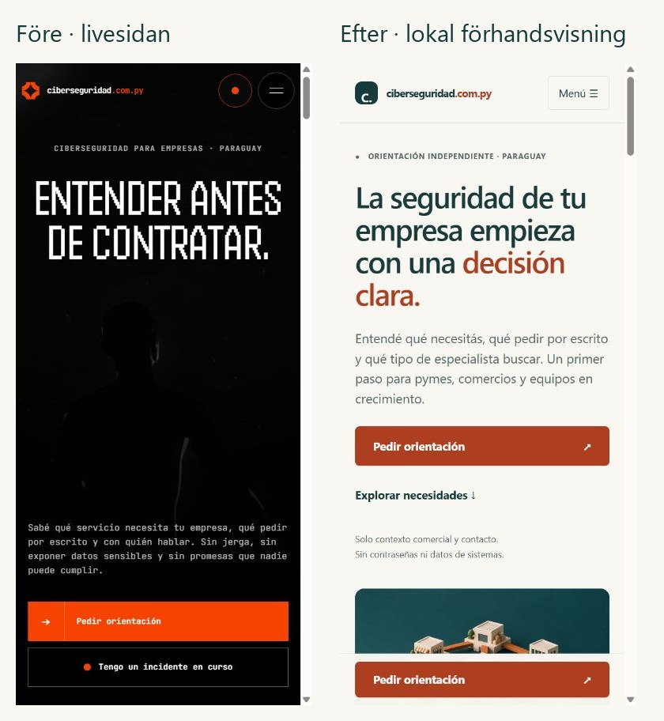

# Leveransrapport: ciberseguridad.com.py

Granskning 4–5 oktober 2026. Kodgren: `codex/business-orientation-redesign`, baserad på `main` vid `a32b5674e49c218506e84e6427cda07ed9974827`. Leveransen är kod och publiceringsunderlag med avstängd mottagning som standard. Ingen merge eller publicering till Hostinger har gjorts.

## Vad livesidan visade

Livesidan granskades först i webbläsare på ungefär 1440 px desktop och 390 px mobil. Sitemap, robots, navigation och vanliga offentliga GET-anrop gav 39 publicerade sidor med status 200. Start, tjänsteutbud, utvärdering, förfrågan/kontakt, guider och integritet ingick. Metadata, canonical, indexeringsdirektiv, H1 och JSON-LD sparades i `live-inventory.json`.

Den faktiska affärsrollen var en oberoende plattform för orientering och upptäckt av leverantörer. Det fanns 17 tjänstebeskrivningar och sju guider, men inga publicerade verifierade leverantörsprofiler. Detta verifierar plattformens publicerade uppgifter, inte Antons egen tekniska kompetens, partnerskap eller mottagarens identitet. En samlad fråga om nyare källkod och verklig mottagare ställdes under arbetet; ingen bekräftelse fanns vid leverans.

Före-bilderna visar mörk hackerpräglad bild, stor pixeltypografi och liten brödtext. På mobil låg den första handlingen sent i inledningen. Förfrågan hade nio obligatoriska fält och ett valfritt e-postfält. Tom validering kontrollerades utan att skicka ett produktionsformulär. Den generella kontaktvägen hos CERT-PY skildes från ett löfte om egen incidentberedskap. Inga angrepp, sårbarhetsskanningar, tredjeparts säkerhetstester eller externa meddelanden gjordes.

Live svarade med PHP 8.3.33 i `X-Powered-By`. HSTS observerades inte i de lästa svaren. Detta är begränsade HTTP-observationer, inte en full säkerhetsgranskning eller ett betyg på hosting, DNS eller TLS.

## GitHub och relationen till live

Standardgrenen `claude/ciberseguridad-strategy-planning-ew88iw` var huvudsakligen planering. `main` innehöll en äldre PHP-implementation med direkt tekniskt tjänsteerbjudande och färre sidor. Även implementationsgrenarna och PR-status kontrollerades; PR 1–4 var redan sammanslagna. `claude/great-goldberg-4zmq7f` hade senare publiceringsfixar, inklusive rotens `.htaccess`, som inte fanns i `main`.

Ingen inspekterad gren innehöll livesidans kompletta nya implementation. Jag har därför inte betecknat `main` som exakt livekälla. Granskad offentlig HTML återfördes till den befintliga PHP-strukturen, med alla 39 liveadresser bevarade. Den senare rotkonfigurationen återanvändes och rättades efter lokala Apache-tester. Den verkliga serverkoden och privata konfigurationen behöver säkerhetskopieras och jämföras före produktionsbyte. Detta är ett konkret deploy- och källkodsgap, inte en anledning att bygga från standardgrenens planeringsdokument.

Arbetet gjordes i en separat klon/kodgren. Annat arbete i den gemensamma överordnade katalogen lämnades kvar. Inga nya Codex-chattar skapades.

## Vad som skapats och förbättrats

- En sammanhängande B2B-design med varm ljus bakgrund, petrolgrönt, rostorange handlingar, systemtypsnitt och större läsbar text. Ny startsida, sidhuvud, sidfot, mobilmeny och matchande favicon.
- En tydlig första väg för små och växande företag: förstå behovet, välja relevant kategori och förbereda en avgränsad första kontakt. Fyra startsidesingångar för utvärdering, konton, backup och utbildning.
- Samtliga 17 befintliga tjänstesidor i samma läsbara skal. De beskriver omfattning, undantag, leveranser att efterfråga, prisfaktorer och frågor inför avtal. Den första skärmen förklarar att plattformen inte utför tjänsten. Ingen egen SOC, expertbemanning, jour, garanti, certifiering eller partner hittades på.
- Tjänstekatalog med fem behovsfilter och alla kort tillgängliga utan JavaScript. Sju befintliga guider återförda med källor, synliga editorialuppgifter och bibehållen markering om väntande teknisk granskning. Ursprungliga publiceringsdatum bevarades, editorialuppdatering sattes till 5 oktober. Ingen namngiven expertgranskare uppfanns.
- Provider-, metod-, kontakt-, korrigerings-, integritets- och policysidor. Inga tomma profilformulär låtsas ta emot dokument. Gamla service-/verktygsadresser och fyra äldre branschsidor har relevanta 301-mål. Inget nytt publikt diagnostikverktyg, ramverk eller databas infördes.
- Ett kortare servervaliderat kontaktflöde med sju synliga fält: företagskategori, storlek, behov, namn, telefon, valfri e-post och samtycke. Inga fritextfält, bilagor, domäner eller IP-uppgifter efterfrågas. Vald tjänst ger ett relevant förval och känd ursprungssida.
- Tydliga felstatusar, bevarade värden vid fel, CSRF, tidsspärr, begränsning av försök och privat registrering före vidareleverans. Formuläret fungerar med vanlig POST och kräver inte JavaScript. Lyckad mottagning lovar inte en tillgänglig specialist eller omedelbar CRM-leverans.
- Förfrågningar är avstängda som standard. Namngiven mottagare och giltig mail-/HTTPS-CRM-konfiguration krävs dessutom i koden. Det är en kontroll av inställningar, inte bevis på ägarskap eller fungerande leverans. Utan konfiguration visas en tydlig förberedelse-/informationsväg.
- Separat privat `orientation-leads.csv`, så att äldre CSV-format inte skrivs över. En verklig append-bugg med upprepade CSV-rubriker rättades. Samtycke lagras; råa upstreamfel och personliga payloads skrivs inte till logg. Referrer sparar bara ursprungsdomän, utan sökväg, parametrar eller fragment. Avvisad mailleverans loggas utan råa detaljer.
- Lokal 30-dagars rensning med låsning och CLI-kommando. Daglig driftuppgift beskrivs, men är inte installerad på Hostinger. CRM, e-post, säkerhetskopior och driftloggar behöver egna regler.
- Canonicals, robots, sitemap, social bild och giltig WebPage-/Article-/Breadcrumb-/Organization-data. Organisationen saknar påhittad adress, telefon eller betyg. Tack- och felsidor är noindex; förfrågningssidan beskriver förberedelser när mottagning är avstängd.
- Rättad Apache-routing i både repo-rot och direkt `public_html`: okända adresser ger 404; interna filer skyddas; `security.txt` fungerar. Testningen hittade först 500-loopar och felomdirigeringar vid felhantering, vilka åtgärdades. Befintliga säkerhetsheaders anpassades utan att lova ett externt säkerhetsbetyg eller preload för okända underdomäner.

## Bilder och budget

Två Higgsfield-generationer med `gpt_image_2_5`, Sunburst, medium, 1k, 3:2. Varje generation kontrollerades och fick en exakt offert på 0,5 kredit före beställning. Båda slutfördes; inga omtagningar, misslyckade jobb, videor, nya projekt, köp eller abonnemang användes. **Sammanlagd offererad kostnad: 1 av högst 100 krediter.** Separat kontoslutavräkning/andra samtidiga arbeten är inte oberoende verifierade. Fullständiga parametrar och jobb-ID finns i `media-log.json`.

Motiven visar abstrakt företagskontinuitet respektive organiserade backupkopior. De är märkta som konceptillustrationer och föreställer inga verkliga kunder, personer, certifieringar eller övervakningscentraler. Fyra responsiva WebP-filer och en 1200×630 social bild levereras. Största heroasseten är 31 958 byte, backupasseten 28 340 byte och socialbilden 63 838 byte. Bildmått, alt-text, srcset och rätt laddningsprioritet finns i HTML. Inga externa bildservrar krävs för produktion.

## Tester och faktisk kontroll

| Kontroll | Resultat |
|---|---|
| Befintlig PHP-svit, isolerad lagring och CRM-mock | 97 godkända, 0 fel |
| Nya orienteringsflödet: validering, samtycke, mockleverans, avbrott, lagring, retention | 25 godkända, 0 fel |
| Konfigurationsspärr | 8 fall, 0 fel |
| SEO-registret | 41 poster, inga fel |
| HTTP med lokal syntetisk formkonfiguration | Se `http-results-enabled.json`, 0 fel |
| Slutlig HTTP med release-standard och intake avstängd | 236 kontroller, 0 fel |
| Apache, båda dokumentrötterna, routing/headers/privata sökvägar | 612 kontroller, 0 fel |
| PHP-syntax | 69 filer under public_html/src/bin/tests på båda PHP-versionerna, inga fel |
| Diff-kontroll | Inga whitespacefel |

PHP-sviter och SEO kördes på PHP 8.3.33 samt tidigare på 8.5.11. Apache-testet använde lokal HTTP och `X-Forwarded-Proto=https` för att kontrollera regler; det var inget live-TLS-test. Serverpaketet innehåller inte testruntimer.

Riktiga efterbilder inspekterades på desktop och mobil: start, tjänst, guide, katalog, formulär och integritet. Ingen horisontell overflow observerades i de kontrollerade mobilvyerna. Filter gav rätt tre skyddstjänster; tjänstval gav rätt backupförval. Tab/Shift-Tab stannar i öppen mobilmeny, Escape stänger den och återför fokus. Tomt formulär stoppades lokalt. En separat lokal render utan JS-assets visade alla 17 tjänster, synlig navigering, dolda oanvändbara filter och ingen overflow. Det är ingen formell WCAG-certifiering eller Lighthouse/Core Web Vitals-mätning.

HTTP-länkkontrollen omfattar 44 interna sid-/assetmål. Primärkällor kontrollerades, bland annat [CERT-PY:s kontakt](https://www.cert.gov.py/contacto/), [NIST CSF 2.0](https://www.nist.gov/publications/nist-cybersecurity-framework-csf-20), [NIST incident guidance](https://csrc.nist.gov/pubs/sp/800/61/r3/final), [CISA:s ransomwareguide](https://www.cisa.gov/stopransomware/ransomware-guide) och [PCI SSC](https://www.pcisecuritystandards.org/standards/pci-dss/). BACN:s lagtext kunde verifieras i sökresultatet, men direktläsning gav 500; ISO:s direktlänk gav 403/challenge. Dessa läsbegränsningar dokumenteras i `source-links.json`. Inga nya definitiva juridiska tidsfrister eller garantier infördes. Befintliga guider är fortfarande editorialinformation med teknisk granskning väntande.

SEO-testet anpassades till publicerade adresser med slutslash. Det äldre ordfiltret avvisade även korrekta förklaringar av ordet certifiering; det kontrollerar nu konkreta fabricerade garantier och antal i stället. Metadata testas mot rimliga längder och unik titel, inte godtycklig minsta beskrivningslängd på 120 tecken. Ändringen ersätter inte manuell innehållsgranskning.

## Före och efter

[Hela nya startsidan](screenshots/after-home-full.jpg), [tjänst på mobil](screenshots/after-service-mobile.jpg), [guide på desktop](screenshots/after-guide-desktop.jpg), [lokal formulärpreview](screenshots/after-request-desktop.jpg). Formulärbilderna använder en uttryckligen syntetisk lokal mottagare; release-konfigurationen innehåller ingen sådan mottagare och intake är avstängd.

## Återstående fakta och driftberoenden

Verifiera den juridiska operatören, verklig mottagare, övervakad kontaktväg, leverans, CRM-/mailretention och ansvar för misslyckad leverans. Inga privata nycklar eller serverinställningar har antagits. Inga partnerprofiler bör publiceras förrän de verifierats. Integritet/terms behöver verksamhetsfakta och relevant lokal granskning innan kommersiell insamling aktiveras. `security.txt` behöver ett verifierat övervakat rapporteringssätt och förnyelse före 29 mars 2027.

Önskad modell i uppdraget var GPT Sol 6.1 High. Själva modellvalet exponeras inte som en inställning som detta kodarbete kan ändra eller verifiera; inget falskt modellbyte rapporteras.

Publiceringspaketet utesluter `.env`, testdata, hemligheter, testruntimer och Git-metadata. `DEPLOYMENT.md` beskriver staging, publicering, konfigurering och rollback. Den slutliga PR:n är draft och får granskas innan merge. Den här leveransen ändrar inte livesidan.

ZIP-paketet innehåller 124 kontrollerade filer, inklusive två driftinstruktioner. `package-results.json` registrerar storlek och SHA-256; den externa `PACKAGE-MANIFEST.json` listar varje fil. Varje fil i arkivet kontrollerades mot sitt innehållshash, och standardinställningen `LEAD_ENABLED=0` verifierades. Skärmbilder och granskningsmaterial levereras separat i GitHub-grenen och katalogen `docs/review/`.
